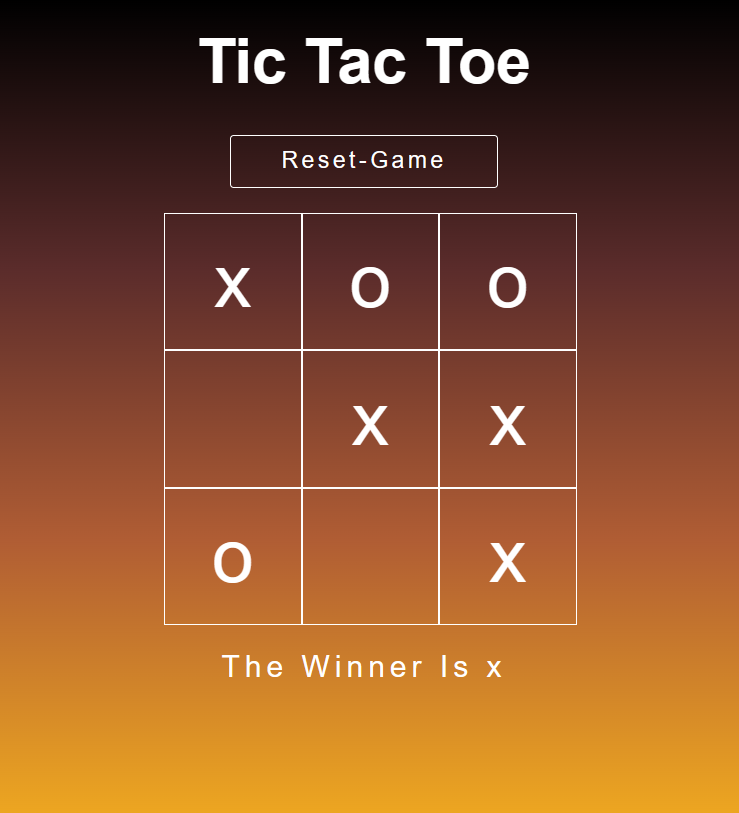
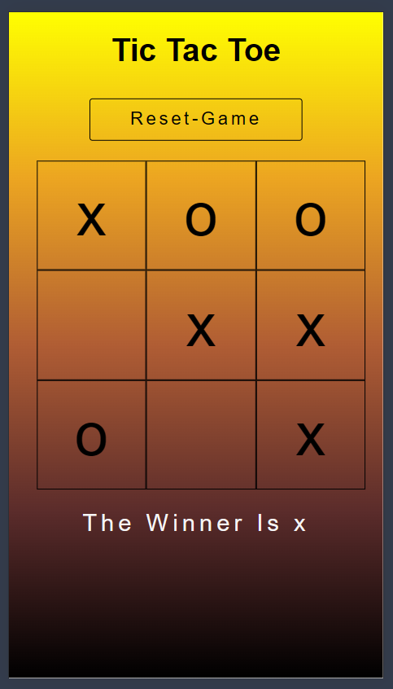

# ❌⭕ Tic Tac Toe Game

A fully responsive Tic Tac Toe game built from scratch using **HTML, CSS, and JavaScript**.
Designed and developed with complete custom logic and UI — no AI assistance used.

---

## 🚀 Features

* Classic 2-player Tic Tac Toe gameplay
* Fully responsive design (mobile + desktop)
* Clean and minimal UI
* Win detection logic
* Draw detection
* Smooth user interaction

---

## 🛠️ Tech Stack

* HTML
* CSS
* JavaScript

---

## 🧠 Development Note

* Entire UI is **self-designed**
* All game logic is **written from scratch**
* No AI tools were used in building this project

---

## 📁 Project Structure

```
tic-tac-toe/
│
├── index.html
├── style.css
├── script.js
├── README.md
└── screenshots/
    ├── desktop.png
    └── mobile.png
```

---

## 📸 Screenshots

### 💻 Desktop View



### 📱 Mobile View



---

## ⚡ How to Run

1. Download or clone the repository
2. Open `index.html` in your browser
3. Start playing

---

## 💡 Future Improvements

* Add AI opponent (single player mode)
* Score tracking system
* Restart / reset animations
* Sound effects

---

## 📌 Author
@suchitrakumar1
Built independently with full logic and design control 💪
